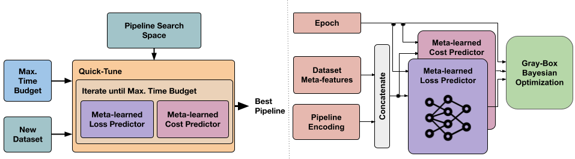

# QuickTune



## Prepare environment
Create environment and install requirements:

```bash
conda -n quick_tune python=3.9
conda activate quick_tune
pip install -r requirements_qt.txt
```

Install torch and gpytorch version:

```bash
conda install pytorch==1.12.1 torchvision==0.13.1 torchaudio==0.12.1 cudatoolkit=10.2 -c pytorch
conda install gpytorch -c gpytorch
```


## Fine-tune a pipeline (fixed Hyperparameters)

You can download a dataset and fine-tune a pipeline. In this example, we will use a dataset from meta-album. The metadataset curves were generated in this way.

```bash
mkdir data && cd data
mkdir mtlbm && cd mtlbm
wget https://rewind.tf.uni-freiburg.de/index.php/s/pGyowo3WBp7f33S/download/PLT_VIL_Micro.zip
unzip PLT_VIL_Micro.zip
```

You can fine-tune network by providing any hyperparameter as follows:

```bash
mkdir output 
python finetune.py data --model dla46x_c \
					--pct_to_freeze 0.8 \
					--dataset "mtlb/PLT_VIL_Micro"\
					--train-split train \
					--val-split val  \
					--experiment test_experiment \
					--output output \
					--pretrained \
					--num_classes 20\
					--epochs 50
```


## Run Quick-Tune on meta-dataset

Download QuickTune meta-dataset:

```bash
mkdir data && cd data
wget https://rewind.tf.uni-freiburg.de/index.php/s/oMxC5sfrkA53ESo/download/qt_metadataset.zip
unzip QT_metadataset.zip
```

Run examples:
```bash
mkdir output
#quicktune on micro
python bash_scripts/run_micro.sh
#quicktune on mini
python bash_scripts/run_mini.sh
#quicktune on extended
python bash_scripts/run_extended.sh

#generate the plot for an experiment
python plots_generation/plot_results_benchmark.py --experiment_id qt_micro
```


## Run on a new dataset

For finetuning a new dataset, you can use the following examples as a reference. They run QuickTune on *Imagenette2-320* and *Inaturalist*.

```bash
#example on imagenette2-320
cd data
wget https://s3.amazonaws.com/fast-ai-imageclas/imagenette2-320.tgz

tar -xvzf imagenette2-320.tgz
cd .. #back to root folder

#before this execute quicktune on mini (above)
python bash_scripts/run_imagenette.sh

#before this execute quicktune on extended (above)
python bash_scripts/run_inaturalist.sh
```

If you use any other dataset, make sure to provide the datasets in a format accepted by Timm library. You have to pass the datasets descriptors for the execution as presented in the example bash scripts. 


